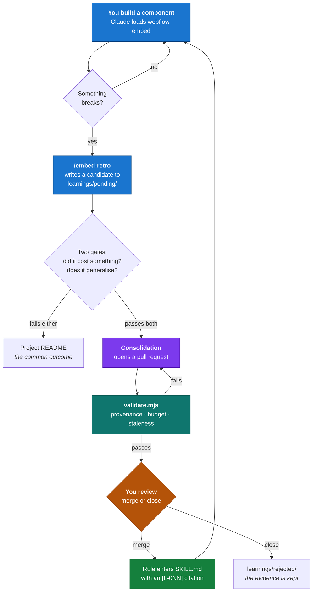

# webflow-embed

A Claude Code skill for building custom interactive components that ship into Webflow —
and a process that makes the skill better every time one of them breaks.

The skill starts with nine hard rules. Eight of them are not advice; they are live bugs
from real builds, each traceable to a file recording the symptom, the cause, the fix,
and the proof.

```
skills/webflow-embed/    the skill Claude loads when you build a component
skills/embed-retro/      the skill that captures what a build taught
learnings/               the evidence every rule points back to
tools/validate.mjs       the check that keeps rules honest and the skill small
.github/workflows/       validation on every push; consolidation into a PR
```

## The loop



The shape that matters: **capture is automatic, promotion is not.** A model can propose
a change to its own instructions; only you merge one. That single gate is what separates
a skill that compounds from a skill that drifts.

## The three rules that keep it from rotting

Self-improving systems fail in predictable ways. Each of these is a countermeasure, and
each is enforced by `tools/validate.mjs` rather than by good intentions.

**1. Every rule cites its evidence.** A rule in `SKILL.md` reads `[L-004]` and that
resolves to a file describing the symptom, the cause, the fix, and the proof. A rule
whose citation does not resolve fails CI:

```
ERROR  SKILL.md cites L-042, which has no learning file.
       A rule without evidence is an opinion.
```

So the skill cannot accumulate plausible-sounding advice. Everything in it happened.

**2. There is a hard line budget.** `SKILL.md` is capped at 250 lines. Nothing raises
it. A tenth rule means compressing or evicting one of the nine, and the PR has to say
which and why. This is the whole game — an instruction file that grows without bound
stops being read, and an unread skill is worse than no skill, because you think you have
one.

**3. Rejection is the expected outcome.** Most findings are specific to one client's
site. Those go in that project's README, not here. `embed-retro` states the two gates
before writing anything, and the consolidator is told in `tools/consolidate-prompt.md`:
*"Rejection is the common and correct outcome. Do not soften a rejection into a weak
rule."*

There is a fourth, smaller one: uncertainty is visible. Rule **R8** is marked
`[L-009 — provisional]` because no logged bug traces to it — it is a sound inference,
not a scar. Its learning file says so, and says exactly what evidence would settle it.
CI enforces the marker: cite a pending learning as settled and the build fails.

## Install

```bash
git clone git@github.com:mattdetails/webflow-embed-skill.git
cd webflow-embed-skill
./install.sh
```

Symlinks both skills into `~/.claude/skills/`, so the repo stays the source of truth —
edit here, and every session picks it up.

## Use it

Start a component build. The skill triggers on its own from a request like *"build a
custom timeline to replace the Relume slider"*, or invoke it directly:

```
/webflow-embed
```

Then, when the build ships or a bug in it gets fixed:

```
/embed-retro
```

That is the entire daily interaction. Everything else runs on its own.

## The consolidation step is optional

Without an API key the repo is a well-organised manual review queue: `/embed-retro`
writes candidates, `validate.mjs` keeps the archive honest, and you promote by editing
`SKILL.md` yourself.

To automate the drafting, add an `ANTHROPIC_API_KEY` repository secret
(Settings → Secrets and variables → Actions). The workflow then runs on Mondays and
whenever a learning is pushed, and opens a PR you review. Without the secret it logs a
notice and exits clean — it never fails a build over a missing key.

`tools/consolidate-prompt.md` is that job's brief, in the repo, editable. If the
consolidator's judgement is off, you fix it by editing that file — the process improves
the same way the skill does.

## Adding a learning by hand

```bash
./tools/new-learning.sh swiper-observeparents-loop
# fill in the file, then
node tools/validate.mjs
git add learnings/pending && git commit -m "Learning: swiper-observeparents-loop"
```

Write the **symptom** separately from the cause, and write it the way you would search
for it in six months — when the symptom is all you have.
